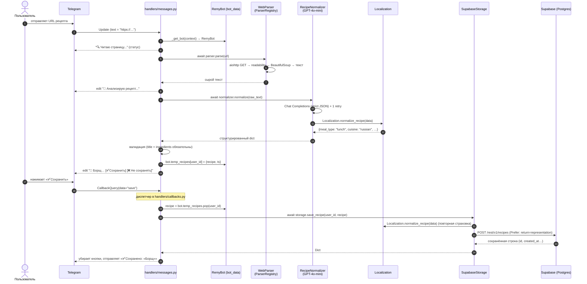
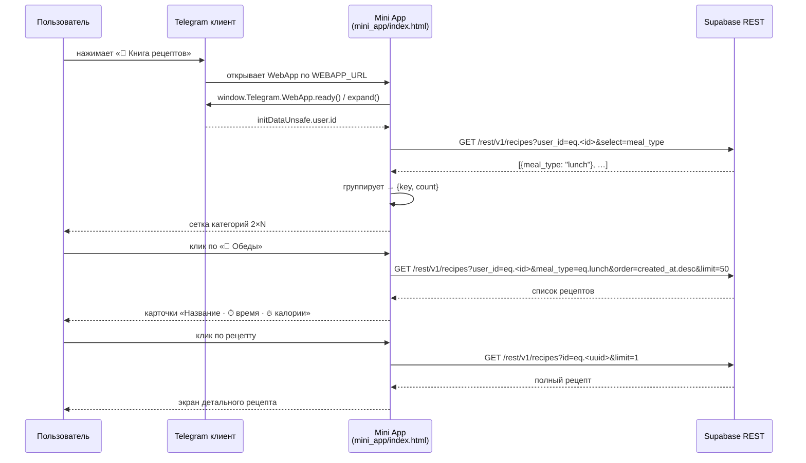

# Архитектура Remy Bot

Документ описывает устройство проекта: как файлы связаны между собой,
какие ответственности у каждого модуля и как данные перетекают от
пользовательского сообщения в Telegram до сохранённой записи в Supabase
и обратно — в Mini App.

---

## 1. Слои и модули

Проект разделён на три ортогональных слоя: **конфигурация/запуск**,
**доменные сервисы**, **презентация (Telegram)** — плюс отдельный
фронтенд-клиент Mini App, который «разговаривает» напрямую с Supabase.

```
┌──────────────────────────────────────────────────────────────┐
│                      run.py (точка входа)                    │
│   single-instance lock │ логирование │ graceful shutdown     │
└──────────────────────────────────────────────────────────────┘
                              │
                              ▼
┌──────────────────────────────────────────────────────────────┐
│                      config.py (Config)                      │
│            загрузка .env, валидация, dataclass               │
└──────────────────────────────────────────────────────────────┘
                              │
                              ▼
┌──────────────────────────────────────────────────────────────┐
│                     src/bot.py (RemyBot)                     │
│  ─── собирает все зависимости, запускает polling PTB ───     │
└──────────────────────────────────────────────────────────────┘
          │                │                │                │
          ▼                ▼                ▼                ▼
 ┌───────────────┐ ┌─────────────┐ ┌────────────┐ ┌───────────────┐
 │ Localization  │ │ ParserReg.  │ │ Normalizer │ │ SupabaseStor. │
 │ (ru-словарь,  │ │ (WebParser, │ │ (GPT-4o,   │ │ (aiohttp →    │
 │  нормализация)│ │  расширяем) │ │  JSON, …)  │ │  PostgREST)   │
 └───────────────┘ └─────────────┘ └────────────┘ └───────────────┘
                              │
                              ▼
┌──────────────────────────────────────────────────────────────┐
│             src/handlers/  (PTB-хендлеры)                    │
│   commands.py │ messages.py │ callbacks.py                   │
│           src/keyboards.py — все клавиатуры                  │
└──────────────────────────────────────────────────────────────┘
                              │
                              ▼
                      ┌──────────────┐
                      │ Telegram API │
                      └──────────────┘
                              │
                              │    (WebApp)
                              ▼
┌──────────────────────────────────────────────────────────────┐
│            mini_app/index.html (vanilla JS)                  │
│   fetch ← Supabase REST ────────────────┐                    │
│   Telegram WebApp SDK: BackButton, user │                    │
└─────────────────────────────────────────┴────────────────────┘
                              │
                              ▼
                     ┌──────────────────┐
                     │  Supabase (PG)   │
                     │  таблица recipes │
                     └──────────────────┘
```

### 1.1. Ответственности по файлам

| Файл | Отвечает за |
| --- | --- |
| `config.py` | Чтение переменных окружения, валидация, immutable `Config` (`@dataclass(frozen=True)`). Падает с понятным сообщением, если чего-то не хватает. |
| `run.py` | Точка входа. Файловая блокировка `/tmp/remy_bot.lock`, настройка логирования (stdout + rotating `logs/remy.log`), HTTP healthcheck `:8081/health`, обработчики `SIGTERM`/`SIGINT`, ленивый импорт `RemyBot`. |
| `src/bot.py` | Класс `RemyBot` — сборка всех сервисов, регистрация хендлеров PTB, `run_polling(stop_signals=None, drop_pending_updates=True)`, `temp_recipes` с TTL 30 мин, потокобезопасный `stop()`. |
| `src/keyboards.py` | Фабрики Reply/Inline-клавиатур и WebApp-кнопок. `callback_data` всегда латиница (проще маршрутизация и 64-байтовый лимит). |
| `src/localization.py` | Нормализация `meal_type`/`difficulty`/`cuisine` в канонические латинские ключи и обратный перевод в русские названия с эмодзи. Статические `normalize_*`, экземплярные `get_*_display`. |
| `src/parser.py` | `BaseParser` (ABC), `WebParser` (aiohttp → readability-lxml → BeautifulSoup), `ParserRegistry.parse(url)` — выбирает подходящий парсер. |
| `src/normalizer.py` | `RecipeNormalizer.normalize(raw_text)` — вызов GPT-4o-mini через GitHub Models, парсинг JSON (с одним ретраем и чисткой Markdown-fence), агрессивная постобработка и `Localization.normalize_recipe`. |
| `src/storage/base.py` | Абстрактный `BaseStorage` — контракт для будущих бэкендов (InMemory, Postgres-native и т. д.). |
| `src/storage/supabase_storage.py` | Реализация поверх Supabase REST (PostgREST): CRUD, категории, поиск с эскейпом, health-check, whitelisting полей. |
| `src/handlers/commands.py` | `/start`, `/menu`, `/help`. |
| `src/handlers/messages.py` | Маршрутизатор текстовых сообщений (кнопки Reply / URL / fallback), URL-пайплайн, HTML-форматтер рецепта (`format_recipe`). |
| `src/handlers/callbacks.py` | Диспетчер `callback_data`: `save`/`dont_save`/`show_categories`/`dishtype_*`/`ingredient_*`/`view_*`/`delete_*`/`back_*`. |
| `mini_app/index.html` | Vanilla-SPA с тремя экранами (категории / список рецептов / детальный). Ходит напрямую в Supabase REST, `user_id` берёт из `Telegram.WebApp.initDataUnsafe`. |
| `sql/create_tables.sql` | Идемпотентный DDL для Supabase: таблица `recipes`, индексы, триггер `updated_at`, политики RLS. |

### 1.2. Dependency Injection

Хендлеры получают общий `RemyBot` через `context.application.bot_data["remy"]`:

```python
# src/bot.py
app.bot_data["remy"] = self
app.add_handler(CommandHandler("start", commands.start))
```

```python
# src/handlers/commands.py
def _get_bot(context):
    return context.application.bot_data["remy"]
```

Это сознательный выбор в пользу **идиоматичных сигнатур PTB**
(`async def handler(update, context)`) и простого мокирования: любой
тест просто кладёт в `bot_data` MagicMock, не оборачивая хендлеры
замыканиями.

---

## 2. Поток данных — сохранение рецепта



Ключевые решения:

- **Статус-сообщение редактируется**, а не заменяется новыми — так
  пользователь видит прогресс одной строкой.
- **Временный кэш `temp_recipes`** хранит рецепт между показом и
  «Сохранить» → позволяет не пересчитывать GPT, если человек уходит
  ненадолго (TTL 30 мин).
- **Двойная нормализация** (`RecipeNormalizer` + `SupabaseStorage`)
  гарантирует, что в БД попадёт канонический латинский ключ даже при
  ручных тестах против `storage.save_recipe()`.
- При любой ошибке парсинга/нормализации кнопки «Сохранить» **не
  показываются** — пользователю возвращается понятный текст ошибки.

---

## 3. Поток данных — Mini App

Mini App не ходит через бота. У него свой HTTPS-домен и прямой доступ к
Supabase REST по `anon`-ключу. Это нормально: ключ публичный по
дизайну, а `user_id` приходит в подписанных `initData` от Telegram
(в текущем MVP мы берём его из `initDataUnsafe.user.id` — этого
достаточно для фильтрации «своих» рецептов).



`Telegram.WebApp.BackButton` синхронизирован со стеком навигации —
нативная стрелка работает как «назад». На экране категорий BackButton
прячется; на всех остальных — показан.

---

## 4. Жизненный цикл процесса

```mermaid
flowchart TD
    A[python run.py] --> B{single-instance<br/>fcntl lock}
    B -- занят --> X[exit 1]
    B -- свободно --> C[setup_logging]
    C --> D[register SIGINT/SIGTERM]
    D --> E[start healthcheck :8081]
    E --> F[import RemyBot]
    F --> G[RemyBot(config)]
    G --> H[app.run_polling<br/>stop_signals=None]
    H -- SIGTERM/SIGINT --> I[run.py handler<br/>→ bot.stop → app.stop_running]
    I --> J[stop healthcheck]
    J --> K[atexit: release lock]
    K --> Z((exit 0))
```

Зачем `stop_signals=None`: `run.py` владеет своими обработчиками
сигналов и логирует «👋 Получен сигнал …». Если бы PTB поставил свои
хендлеры поверх наших, мы потеряли бы этот лог и корректное
освобождение ресурсов (healthcheck-сокет, файловая блокировка).

---

## 5. Хранение данных

Таблица `recipes` — одна, универсальная. Все «развесистые» поля
(ингредиенты, шаги, КБЖУ) уехали в `JSONB`, чтобы не разводить зоопарк
таблиц ради прямолинейного чтения на фронте.

| Поле | Тип | Комментарий |
| --- | --- | --- |
| `id` | `UUID` PK | `gen_random_uuid()` |
| `user_id` | `BIGINT` | Telegram user id (не FK — пользователей у нас нет как сущности) |
| `title`, `description`, `storage`, `source_url` | `TEXT` | — |
| `cuisine`, `meal_type`, `difficulty` | `TEXT` | Только **канонические латинские ключи** (см. `Localization.VALID_*`) |
| `prep_time`, `cook_time`, `total_time`, `servings` | `INTEGER` | Минуты, порции |
| `ingredients`, `steps`, `nutrition`, `nutrition_per_serving`, `total_nutrition` | `JSONB` | Структуру диктует `RecipeNormalizer` |
| `equipment`, `tips`, `tags` | `TEXT[]` | Простые массивы строк |
| `is_vegetarian`, `is_vegan`, `is_gluten_free`, `is_lactose_free` | `BOOLEAN` | — |
| `created_at`, `updated_at` | `TIMESTAMPTZ` | Триггер `trg_recipes_set_updated_at` обновляет `updated_at` на каждом `UPDATE` |

`ingredients` хранится как массив объектов `{name, amount, unit, notes, estimated}`.
`estimated=true` означает, что граммовка была оценена ИИ, потому что источник не
содержал точного количества; Mini App показывает такую оценку со звёздочкой.

Индексы: `user_id`, `meal_type`, составной `(user_id, meal_type)` и
`created_at DESC`. Достаточно для всех текущих запросов.

RLS включён, но в MVP политики разрешают всё с `USING (TRUE)` —
изоляция пользователей делается **фильтром в коде** (`user_id=eq.<X>`
в каждом GET, явная проверка `user_id` в `delete_recipe`). При
переходе на аутентификацию JWT политики нужно будет сузить до
`auth.uid() = user_id`.

---

## 6. Точки расширения

- **Новый парсер (YouTube Shorts, Instagram, TikTok)**: унаследуйся от
  `BaseParser`, реализуй `can_parse(url)` + `async def parse(url)` и
  зарегистрируй в `create_parser_registry()` — `ParserRegistry.parse`
  автоматически его найдёт.
- **Новое хранилище** (InMemory для тестов, свой Postgres): реализуй
  `BaseStorage`, подмени в `RemyBot.__init__`. Ни один хендлер не
  знает деталей Supabase.
- **Новый язык**: добавь словарь в `Localization.TRANSLATIONS` и
  передай `Localization("fr")` в конструктор бота. На фронте Mini App
  — такой же словарь в `LOCALE`. См. [`docs/localization.md`](localization.md).
- **Новая кнопка/экран**: клавиатура → `keyboards.py`, поведение →
  соответствующий хендлер в `src/handlers/`.

---

## 7. Нефункциональные решения

| Свойство | Решение |
| --- | --- |
| **Один экземпляр** | `fcntl.lockf` + `/tmp/remy_bot.lock`. Два процесса на одном инстансе Railway просто не поднимутся. |
| **Graceful shutdown** | SIGTERM/SIGINT в `run.py` → `bot.stop()` → `Application.stop_running()`. Завершение cleanup-ом освобождает лок (`atexit`) и закрывает healthcheck. |
| **Без чужих сигналов** | `run_polling(stop_signals=None)` — PTB не трогает signal-handlers. |
| **Идемпотентный DDL** | `IF NOT EXISTS`, `CREATE OR REPLACE`, `DROP POLICY IF EXISTS` → безопасный повторный запуск. |
| **Без секретов в коде** | Всё через env; `.env` в `.gitignore`; anon-ключ Mini App — публичный по дизайну Supabase. |
| **Логи на русском** | Единый формат `дата \| уровень \| логгер \| сообщение`, удобно читать `tail -f logs/remy.log`. |
| **Zero-blocking healthcheck** | Отдельный daemon-поток, 200 ms → `{"status":"ok"}`. Railway / k8s могут использовать для liveness. |

---

## 8. Что будем делать дальше

- Миграция RLS на `auth.uid() = user_id` и Telegram OAuth через Edge Functions.
- Полноценный поиск по `ingredients`/`steps` (JSONB `@>`, pg_trgm).
- Второй язык в UI + Mini App.
- YouTube Shorts парсер (расшифровка субтитров + вызов нормализатора).
- Docker-compose для локальной разработки без Supabase (in-memory storage).
