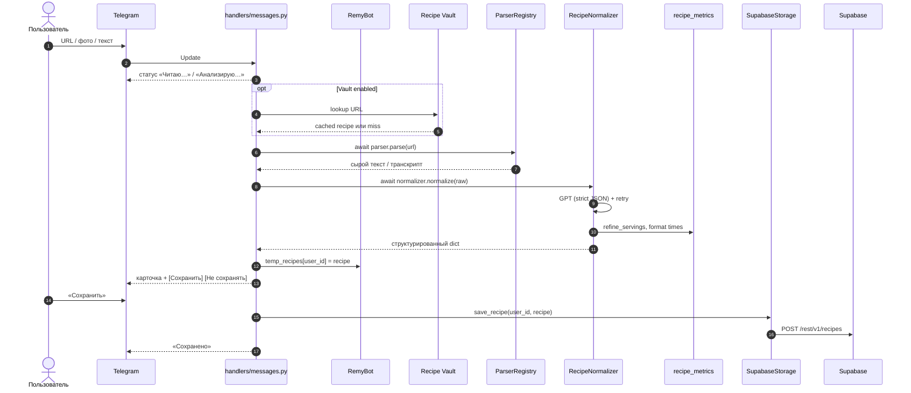
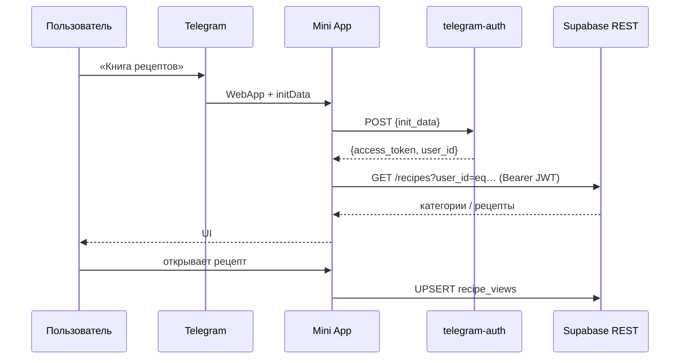
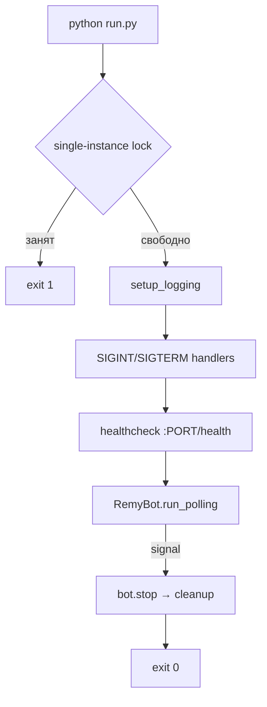

# Архитектура Remy Bot

Документ описывает устройство проекта: как файлы связаны между собой,
какие ответственности у каждого модуля и как данные перетекают от
пользовательского сообщения в Telegram до сохранённой записи в Supabase
и обратно — в Mini App.

---

## 1. Слои и модули

Проект разделён на три ортогональных слоя: **конфигурация/запуск**,
**доменные сервисы**, **презентация (Telegram)** — плюс отдельный
фронтенд-клиент Mini App, который авторизуется через Edge Function и
ходит в Supabase REST с JWT.

```
┌──────────────────────────────────────────────────────────────┐
│                      run.py (точка входа)                    │
│   single-instance lock │ логирование │ graceful shutdown     │
│   healthcheck /health + /ready (polling + Supabase)          │
└──────────────────────────────────────────────────────────────┘
                              │
                              ▼
┌──────────────────────────────────────────────────────────────┐
│                      config.py (Config)                      │
│            загрузка .env, валидация, dataclass               │
└──────────────────────────────────────────────────────────────┘
                              │
                              ▼
┌──────────────────────────────────────────────────────────────┐
│                     src/bot.py (RemyBot)                     │
│  ─── собирает все зависимости, запускает polling PTB ───     │
└──────────────────────────────────────────────────────────────┘
          │                │                │                │
          ▼                ▼                ▼                ▼
 ┌───────────────┐ ┌─────────────┐ ┌────────────┐ ┌───────────────┐
 │ Localization  │ │ ParserReg.  │ │ Normalizer │ │ SupabaseStor. │
 │ (ru-словарь,  │ │ Web/YouTube │ │ (GPT-5,    │ │ (service role │
 │  нормализация)│ │ IG/TikTok/VK│ │  JSON, …)  │ │  → PostgREST) │
 └───────────────┘ └─────────────┘ └────────────┘ └───────────────┘
          │                │                │
          ▼                ▼                ▼
 ┌───────────────┐ ┌─────────────┐ ┌────────────────┐
 │ recipe_metrics│ │ recipe_vault│ │ handlers/      │
 │ время, порции │ │ URL-кэш     │ │ commands, msgs │
 └───────────────┘ └─────────────┘ └────────────────┘
                              │
                              ▼
                      ┌──────────────┐
                      │ Telegram API │
                      └──────────────┘
                              │
                              │    (WebApp)
                              ▼
┌──────────────────────────────────────────────────────────────┐
│            mini_app/index.html (vanilla JS)                  │
│   telegram-auth → JWT │ fetch + Bearer → Supabase REST       │
│   Telegram WebApp SDK: BackButton, safe area, fullscreen     │
└──────────────────────────────────────────────────────────────┘
                              │
                              ▼
                     ┌──────────────────┐
                     │  Supabase (PG)   │
                     │  recipes, views, │
                     │  vault, shares   │
                     └──────────────────┘
```

### 1.1. Ответственности по файлам

| Файл | Отвечает за |
| --- | --- |
| `config.py` | Чтение переменных окружения, валидация, immutable `Config`. |
| `run.py` | Single-instance lock, логирование, healthcheck на `$PORT`, graceful shutdown. |
| `src/bot.py` | `RemyBot` — сборка сервисов, polling PTB, `temp_recipes` с TTL. |
| `src/keyboards.py` | Reply/Inline-клавиатуры, WebApp-кнопки, валидация `WEBAPP_URL`. |
| `src/localization.py` | Канонические латинские ключи ↔ русские названия с эмодзи. |
| `src/parser.py` | `WebParser`, `YouTubeParser`, `InstagramParser`, `TikTokParser`, `VkVideoParser`; изображения, Whisper, Apify. |
| `src/normalizer.py` | `RecipeNormalizer` — GPT через GitHub Models, JSON-схема, постобработка. |
| `src/recipe_metrics.py` | Форматирование времени, оценка порций (USDA RACC), отображение КБЖУ. |
| `src/recipe_vault/` | Глобальный кэш URL → рецепт (draft/golden, promote по хитам). |
| `src/storage/supabase_storage.py` | CRUD, категории, поиск; **service_role** (обходит RLS для бота). |
| `src/handlers/` | Команды, URL/фото/текст, callbacks (save, share, delete, категории). |
| `mini_app/index.html` | SPA: JWT-auth, категории, тёмная тема, `recipe_views`, safe area. |
| `supabase/functions/telegram-auth/` | Валидация `initData` → JWT с claim `telegram_user_id`. |
| `sql/migration_rls_*.sql` | RLS: `remy_telegram_user_id()`, изоляция по пользователю. |

### 1.2. Dependency Injection

Хендлеры получают общий `RemyBot` через `context.application.bot_data["remy"]`:

```python
# src/bot.py
app.bot_data["remy"] = self
app.add_handler(CommandHandler("start", commands.start))
```

```python
# src/handlers/commands.py
def _get_bot(context):
    return context.application.bot_data["remy"]
```

---

## 2. Поток данных — сохранение рецепта



Ключевые решения:

- **Статус-сообщение редактируется** — пользователь видит прогресс одной строкой.
- **`temp_recipes`** с TTL 30 мин — не пересчитывать GPT между показом и сохранением.
- **Recipe Vault** — повторные URL отдаются из кэша без повторного парсинга.
- При ошибке кнопки «Сохранить» **не показываются**.

---

## 3. Поток данных — Mini App

Mini App **не ходит через бота**. Авторизация и доступ к данным:

1. `Telegram.WebApp.initData` → POST `functions/v1/telegram-auth`.
2. Edge Function проверяет подпись Telegram, выдаёт JWT (`role: authenticated`, claim `telegram_user_id`).
3. Все запросы к PostgREST — с `Authorization: Bearer <jwt>` и anon-ключом.
4. RLS-политики сравнивают `user_id` строки с `remy_telegram_user_id()` из JWT.



Дополнительно:

- **Тёмная тема** — `localStorage remy_theme`, CSS `data-theme="dark"`.
- **Просмотренные рецепты** — `recipe_views` в Supabase + merge с `localStorage`.
- **Safe area** — `applyTelegramInsets()`: в fullscreen суммирует `contentSafeAreaInset + safeAreaInset`; в fullsize (с шапкой TG) отступ 0.
- **Шаринг** — `pending_shares` или deep link `/start share_<uuid>`.

---

## 4. Безопасность и RLS

| Компонент | Ключ / роль | Доступ |
| --- | --- | --- |
| Бот (Railway) | `service_role` | Полный доступ, обходит RLS |
| Mini App | `anon` + JWT | Только свои строки через RLS |
| Recipe Vault | service role only | Anon/authenticated не читают vault |
| Edge Function | `TELEGRAM_BOT_TOKEN` в secrets | Валидация initData |

Функция `remy_telegram_user_id()` читает claim из JWT и используется в политиках
`recipes`, `pending_shares`, `recipe_views`.

Dev-режим Mini App в браузере: `?user_id=123&dev_secret=<REMY_DEV_AUTH_SECRET>`.

---

## 5. Хранение данных

### Таблица `recipes`

Основная таблица. «Развесистые» поля — в `JSONB`.

| Поле | Тип | Комментарий |
| --- | --- | --- |
| `id` | `UUID` PK | `gen_random_uuid()` |
| `user_id` | `BIGINT` | Telegram user id |
| `title`, `description`, `source_url` | `TEXT` | — |
| `cuisine`, `meal_type`, `difficulty` | `TEXT` | Канонические латинские ключи |
| `prep_time`, `cook_time`, `total_time` | `INTEGER` | Минуты; total включает пассивное время |
| `servings` | `INTEGER` | Порции (оценка USDA RACC при отсутствии в источнике) |
| `ingredients`, `steps`, `nutrition*` | `JSONB` | Структура от `RecipeNormalizer` |
| `equipment`, `tips`, `tags` | `TEXT[]` | — |

`ingredients[].estimated=true` — граммовка оценена ИИ.

### Дополнительные таблицы

| Таблица | Назначение |
| --- | --- |
| `pending_shares` | Очередь шаринга из Mini App (Menu Button) |
| `recipe_vault` | Глобальный кэш URL → нормализованный рецепт |
| `recipe_views` | Просмотренные рецепты (синхронизация между устройствами) |

---

## 6. Жизненный цикл процесса



`run_polling(stop_signals=None)` — сигналы обрабатывает `run.py`, не PTB.

Healthcheck слушает `PORT` из окружения (Railway). `/ready` — строже: polling + Supabase.

---

## 7. Точки расширения

- **Новый парсер**: наследник `BaseParser` → регистрация в `create_parser_registry()`.
- **Новое хранилище**: реализация `BaseStorage` → подмена в `RemyBot.__init__`.
- **Новый язык**: словарь в `Localization.TRANSLATIONS` + `LOCALE` в Mini App.
- **Новая кнопка**: `keyboards.py` + хендлер в `src/handlers/`.

---

## 8. Нефункциональные решения

| Свойство | Решение |
| --- | --- |
| Один экземпляр | `fcntl` + `/tmp/remy_bot.lock`; `numReplicas = 1` на Railway |
| Graceful shutdown | SIGTERM/SIGINT → `bot.stop()` → освобождение lock и healthcheck |
| Идемпотентный DDL | `IF NOT EXISTS`, `DROP POLICY IF EXISTS` |
| Секреты | Только через env; service_role никогда в Mini App |
| Лимиты | Rate limit на URL/фото/текст; Apify runs per day |
| Изображения | Том `/images` на Railway; опционально Supabase Storage + FLUX |

---

## 9. Возможные улучшения

- Полнотекстовый поиск по `ingredients` / `steps` (pg_trgm, JSONB).
- Второй язык в UI.
- Скрытие дублирующей кнопки «← Назад» при нативном BackButton Telegram.
- Docker-compose с in-memory storage для локальной разработки без Supabase.
